# 宇宙线缪子小塑闪触发拓扑、几何接受度与板状塑闪光分享模拟研究（第三阶段）

**阶段状态**：本报告完成 **几何接受度 + 拓扑 + 多径迹/串扰 toy + 穿板 + 能量/clipping 代理** 全链（研究问题 A、B、C、D、E 及串扰；第 1–9、14 问）。
**stacked Geant4 光学相**（研究 F、O0–O5、G、光分享对比；第 10–13 问）为下一阶段（接口已就绪，见 §11）。

---

## 1. 目标与范围

真实装置 = 4 块小塑闪（2×3×3 cm，Ch0–Ch3）+ 1 块 20×20×2 cm 板状塑闪 + 板周 8 个 SiPM（Ch4–Ch11）+ 3 块 Haasoscope。
硬件 trigger 仅由 Ch0–Ch3 参与（≥2 块过阈）。数据 262 个 DAQ 事件：260 个 M2、2 个 M3、0 个 M4。
本阶段用**纯几何 MC（不含光学）**回答：单宇宙线缪子的几何接受度能否解释观测的触发拓扑结构？并把后续光学所需的 stacked 几何搭好接口。

## 2. 坐标系与几何（全部写入 `configs/geometry.yaml`）

- `x` 水平(+右)，`y` 水平(+背)，`z` 竖直(+上)；缪子向 −z。
- 小塑闪：2(x)×3(y)×3(z) cm，2 cm 边与板边(x)对齐。
- 同层两块以 3×3(yz) 面相对，**净间距 = `same_layer_gap`（标称 10 cm）**；中心 x=±(gap/2+1)。
- 上下层中心 z=±L/2（L=层间距，扫描 8–12 cm）；板 z∈[−1,+1]cm。
- 通道：Ch0 上右、Ch1 上左、Ch2 下右、Ch3 下左。板 SiPM：右面Ch4/5、背Ch6/7、左Ch8/9、正Ch10/11。

## 3. 宇宙线模型

dN/dΩ ∝ cosⁿθ，θ=天顶角。`cosθ = u^(1/(n+1))`，φ均匀。扫描 n∈{1.5,2,2.5,3}。生成面 z=+60 cm，±60 cm（1.2 m×1.2 m，足以捕获斜径迹）。每点 3×10⁶ 缪子（focused 高统计 3×10⁷）。

## 4. 研究问题 A：单缪子能否解释"几乎全是 2-hit"与同层 double

**结论：不能。** 标称几何（gap=10 cm）下，**同层 double（01=Ch0&Ch1，23=Ch2&Ch3）= 0**（6×10⁷ 缪子全扫描零事件），而数据同层占 **52%**。

| 拓扑 | 含义 | MC（n=2,L=10） | 数据 |
|---|---|---|---|
| 01 | 上层同层 | **0.000** | 0.300 |
| 23 | 下层同层 | **0.000** | 0.219 |
| 02 | 右跨层 | 0.429 | 0.215 |
| 13 | 左跨层 | 0.513 | 0.096 |
| 03 | 对角 | 0.026 | 0.096 |
| 12 | 对角 | 0.033 | 0.073 |

（图 `topology/07_topology_fractions_log.png`、`topology/08_same_layer_frac.png`）
- 同层需要径迹在 3 cm 高度内横跨 ≥10 cm ⇒ θ≥73°，cos²θ 下几乎不存在。
- MC 预测 **02≈13（左右对称）**，而数据 **02/13≈2.2**（明显不对称）→ 真实装置存在左右效率/对齐不对称，非本几何能复现。

**几何敏感性（关键）**：同层 double 仅在两块小闪**净间距 ≤ ~2 cm** 时才出现：
| gap(cm) | 0.5 | 1 | 1.5 | 2 | 3 | ≥4 |
|---|---|---|---|---|---|---|
| 同层占 M2 | 0.62 | 0.48 | 0.27 | 0.14 | 0.002 | **0** |
（图 `comparison/gap_scan_samelayer.png`、表 `tables/gap_scan.csv`）
⇒ **数据的 52% 同层率，几何上只可能在 gap≤~2 cm 实现；与"标称 10 cm"根本不兼容。** 这要么意味着真实几何与描述不符（块实际很近/取向不同），要么同层事件来自非几何机制。

## 5. 研究问题 B：M2/M3/M4

单缪子 **M3=0、M4=0**（全扫描），数据 M3=2/262=0.8%、M4=0。
（图 `topology/09_multiplicity.png`）⇒ 单缪子结构上无法产生观测的 M3（虽小但非零），M4 一致为 0。

## 6. 研究问题 C：多径迹 / 串扰 toy（明确标注：非精确簇射物理）

在单径迹 4-bit 命中分布上做最小 toy：
- **独立双径迹**（第二条宇宙线径迹，概率 p_multi）：即便 p_multi=1，**同层上限仅 ~1.4%**（远低于 52%）。独立多缪子**不能**解释同层。
- **随机 fake-hit**（真实命中后其余通道以 p_fake 附加假命中）：p_fake≈0.16 时 6 拓扑 G-test 较低，但**同时把 M3 抬到 ~11%（数据 0.8%）且拓扑被洗成近似均匀(各~0.167)**——与数据的"同层主导+低 M3"结构冲突，**不自洽**。
（图 `comparison/39_toy_same_layer.png`、`40_toy_gtest.png`；表 `tables/toy_summary.csv`）
⇒ **两个最小 toy 都无法同时复现"同层主导 + M3 极少"。** 需要相关联的多命中机制、或同层事件是不同背景，或几何与描述不符。

## 7. 研究问题 D：跨层 pair 是否几乎必然穿板

**P(穿板 | 跨层 pair) = 1.000**（02/13/03/12 全部，inclusive & exclusive）。
（图 `acceptance/13_slab_cross_prob.png`、`14-17_slab_heatmaps.png`；表 `tables/slab_crossing_by_topology.csv`）
⇒ **跨层 panel-negative 事件无法用"几何没穿板"解释**——几何上跨层缪子 100% 穿板，故 panel 阴性必来自阈值/电子学/背景/光收集，而非几何未命中。板交点 (x,y) 集中在 ±x≈6 cm 附近（小闪正下方），与 Ch10/Ch11 位置自洽。

## 8. 研究问题 E：path-length → Edep / clipping 代理（无光学）

MIP dE/dx≈2.05 MeV/cm。跨层事件：小块 path≈3 cm（~6 MeV）、板 path≈2 cm（~4 MeV），分布集中、**无长径迹事件**（因同层=0）。
（图 `energy/19-20_small_edep_by_topo.png`、`23_clipping_vs_topo.png`、`24-25_clipping_vs_panel.png`）
⇒ 纯单缪子几何**难以自然产生"clipped ⇔ panel bright"的强关联**：既没有长 path 的同层事件，跨层穿板又近 100%。要解释实验中"clipped→panel 响应 88–100%、未 clipped→0–9%"的强关联，**除几何外还需选择/背景或 stacked 光学**（下阶段）。

## 9. 系统学稳健性

| 结论 | 稳健性 |
|---|---|
| 同层 double 在 gap≈10 cm 下=0 | **稳健**（n、L 全扫描、6×10⁷ 缪子均为 0） |
| 同层需 gap≤~2 cm | **稳健**（单调，阈值清晰） |
| 跨层 P(穿板)=1 | **稳健**（所有 n、L、跨层拓扑） |
| M3=M4=0（单缪子） | **稳健** |
| 数据左右不对称(02/13≈2.2) | **敏感**（取决于真实对齐/效率，本几何对称） |
| 层间距 L | 对**跨层比例**轻度敏感，对同层结论无影响 |

## 10. 对 14 个关键问题的回答（本阶段）

| # | 问题 | 结论 | 可信度 |
|---|---|---|---|
| 1 | 单缪子能否解释同层 double？ | **否** | 高 |
| 2 | 差距多少？ | 标称几何下为**零**；解释需 gap≤2 cm 或非几何机制 | 高 |
| 3 | 单缪子能否解释 260/2/0？ | 拓扑不符（同层）、M3 预测 0 vs 数据 2 | 高 |
| 4 | multi-track 能否改善？ | **否**（独立双径迹同层≤1.4%） | 高 |
| 5 | fake-hit 需多大？ | ~0.16 接近拓扑形态，但 M3→11%、拓扑趋均匀，**不自洽** | 高 |
| 6 | T02/13/03/12 多少穿板？ | **100%** | 高 |
| 7 | 跨层 panel-negative 能否靠"没穿板"？ | **否**（P=1） | 高 |
| 8 | same-layer trigger 穿板率？ | MC 无 same-layer 事件，无法直接评；若 gap 小出现则 <1 | 中 |
| 9 | path-length 能否解释 clipping↔panel？ | 单缪子几何**难以**（无长径迹事件） | 中 |
| 14 | 实验 M8 是否需 common-mode？ | 待光学相（见 §11） | 待定 |
| 10–13 | 光分享 / 表面参数 / M8 阈值 | **下一阶段（stacked Geant4 光学）** | 待定 |

## 11. 下一阶段：stacked Geant4 光学（研究 F、O0–O5、G）

- 新建 **StackedDetector**（上层小闪 → 板 → 下层小闪，同一条缪子同时记录小闪/板/各 SiPM 光子），复用现有 `Scint`/ESR/SiPM 材质与 `SingleSlabSiPMSensitiveDetector`。
- 分级光学 O0→O5：O0 理想局部垂直（复现旧 605/475）；O1 换真实宇宙线径迹 + T02/T13 trigger；O2 扫粗糙度 σ_α{0,2,5,10,20,30}°；O3 改 specular/diffuse；O4 反射率{0.90..0.99}；O5 加 PDE/统计/低阈/噪声。
- 直比实验光分享（f_i、X_front=(N11−N10)/(N11+N10)、T02/T13 ROC、Mahalanobis/χ²）；panel M 分布 vs 阈值、M8 概率 vs 表面模型。
- 跑量大 → HTCondor；每个光学模型独立 job。

## 12. 复现

```bash
source $SIMU_ENV  (env/inpac.sh)
cd simulation_v3
python3 scripts/acceptance_mc.py                       # 全扫描 + summary
python3 scripts/acceptance_mc.py --focus --fn 2 --fL 10 --fN 30000000   # 高统计触发记录
python3 scripts/analyze.py                             # 图+表（接受度/拓扑/穿板/能量）
python3 scripts/toys.py                                # 多径迹/fake-hit toy
```

## 13. 产出索引

- 图：`figures/{acceptance,topology,energy,comparison}/*.png`（gap 扫描、拓扑 vs 数据、Multiplicity、穿板概率/热图、Edep/clipping、toy）。
- 表：`tables/{topology_vs_data,slab_crossing_by_topology,gap_scan,toy_summary}.csv`。
- 数据：`processed/{summary.json, triggered_n2.0_L10.npz, triggered_n2.5_L10.npz}`。

> 注：本阶段为纯几何 MC（Python，秒级～分钟级），不含 Geant4 光学；光学相（§11）将补齐第 10–13、14 问与对应图（26–38、41）。

---

## 附录 A：关键图（embedded）

**拓扑与接受度**

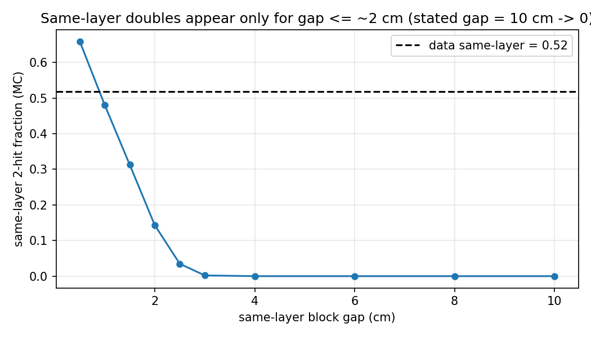

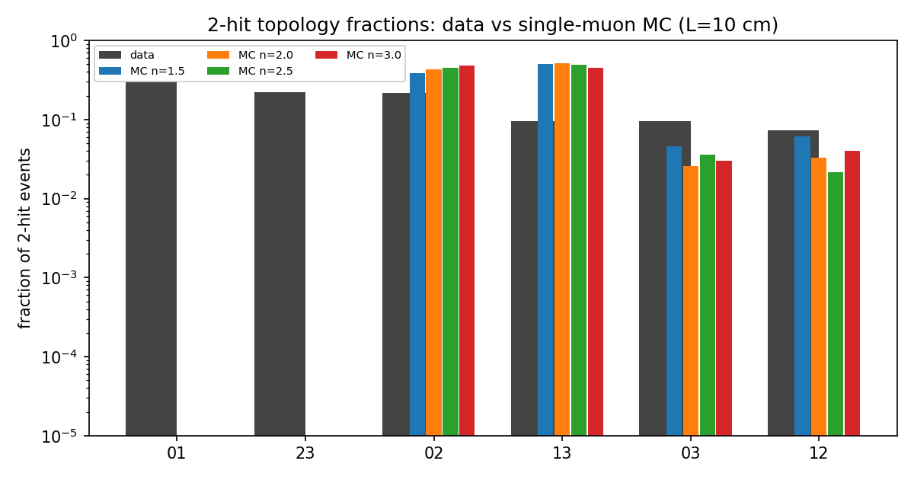

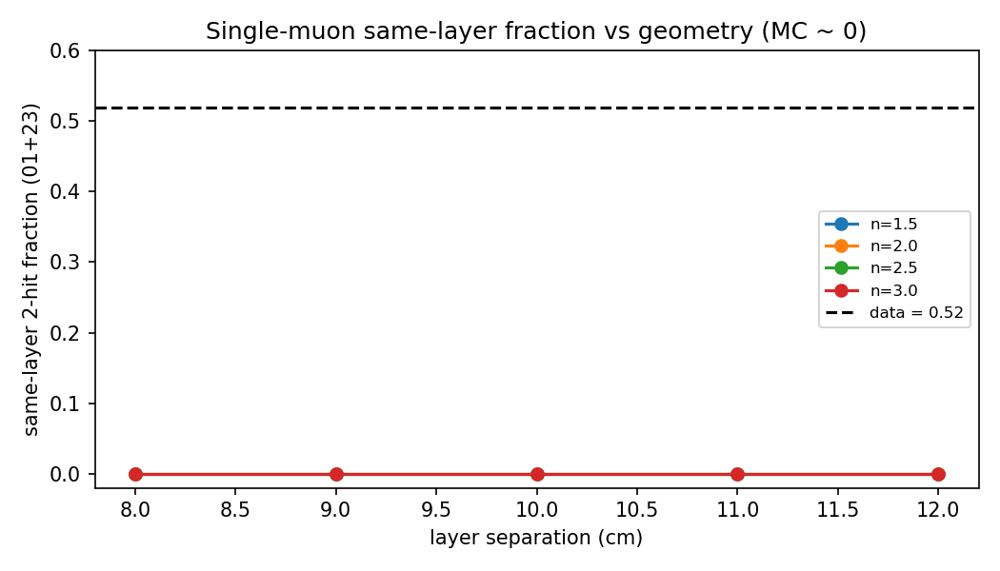

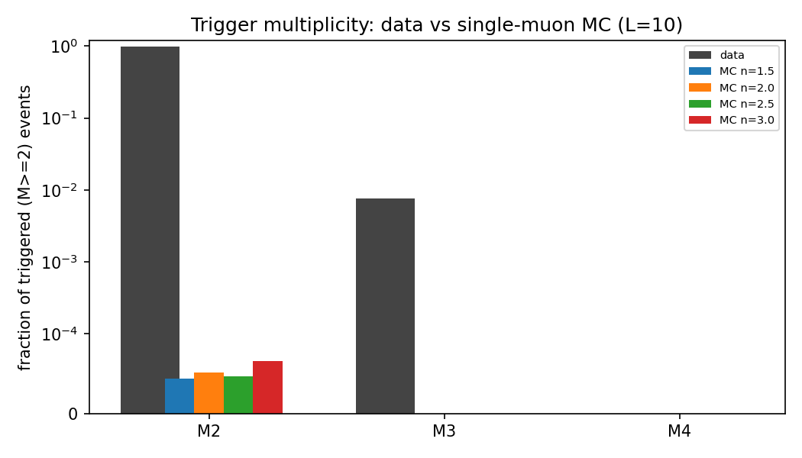

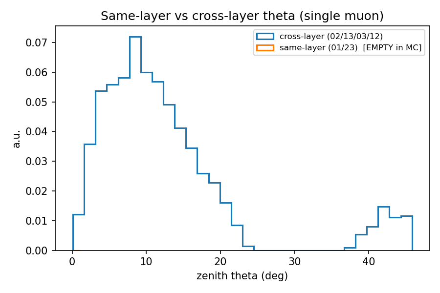

**穿板**

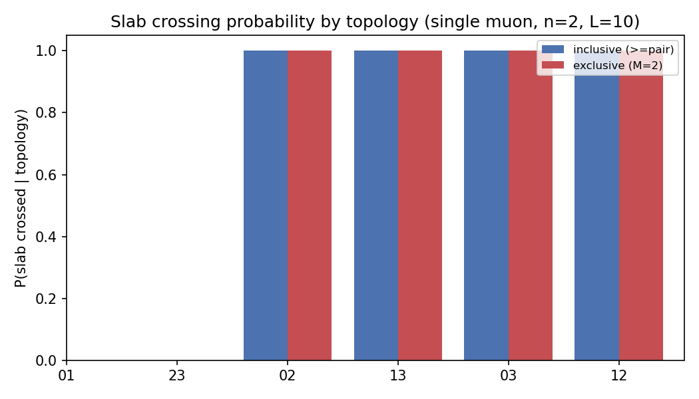

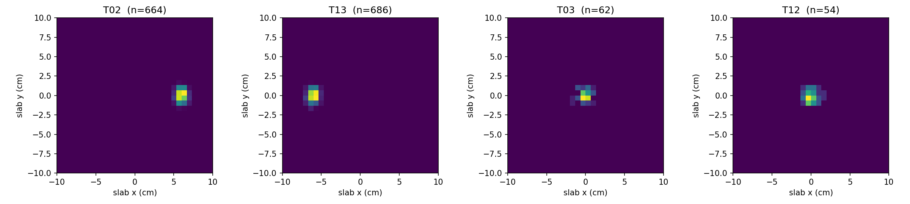

**能量/clipping 代理**

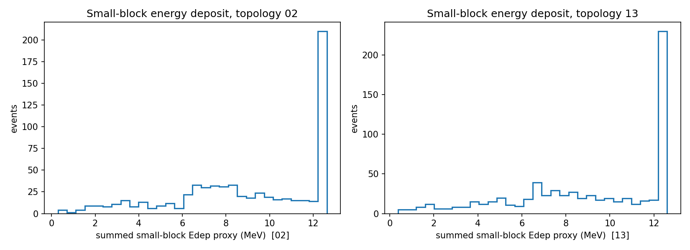

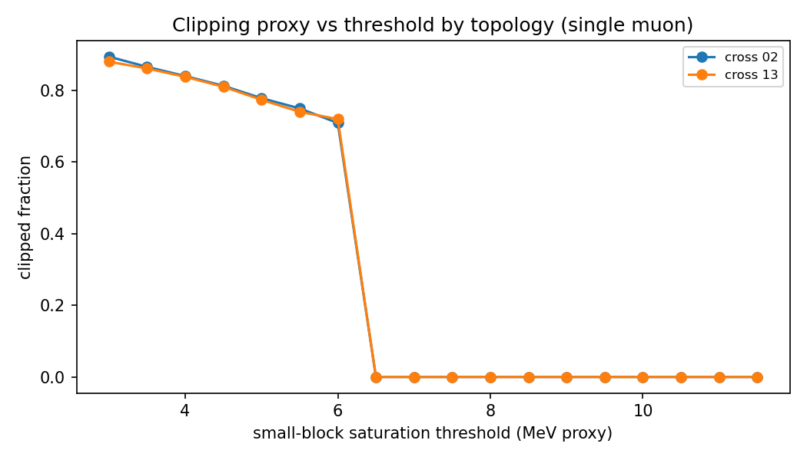

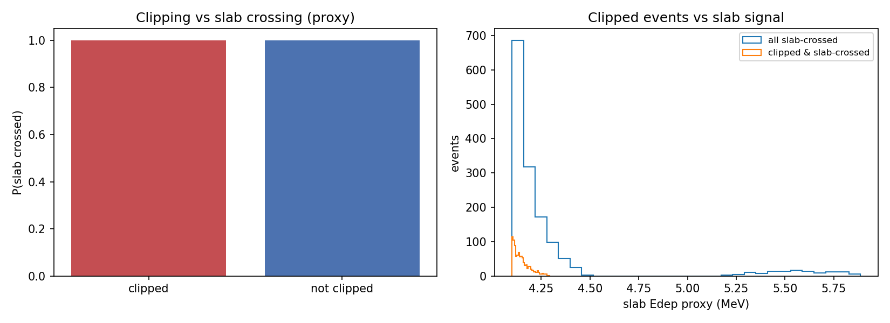

**toy 模型**

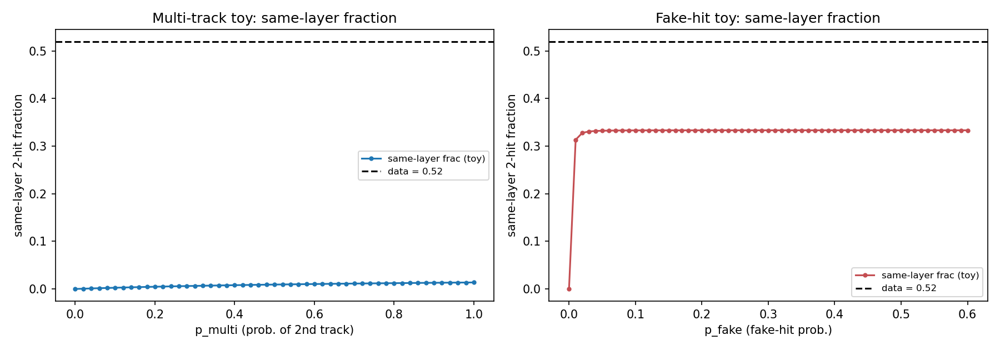

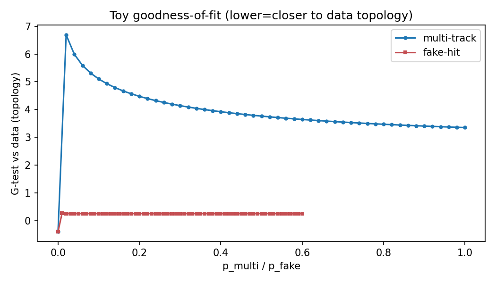

